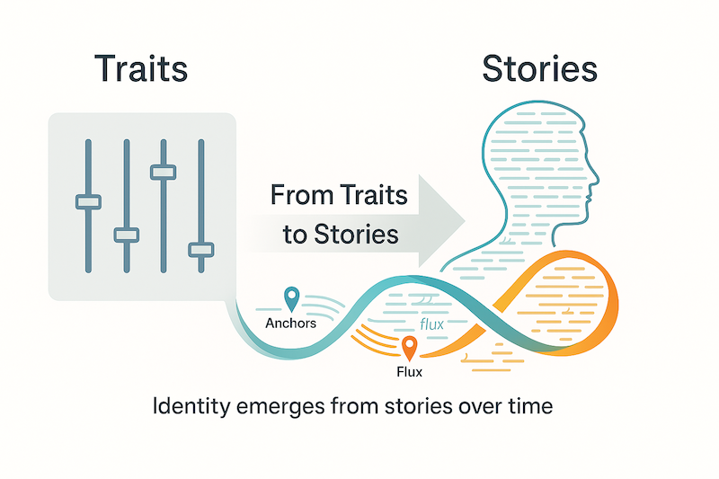

# Narrative Memory for Virtual Humans: A Proof-of-Concept

This repository contains the proof-of-concept (PoC) for a research project exploring a new paradigm for virtual human memory. Instead of relying on brittle, fixed personality traits, we investigate an emergent identity shaped by stories and experiences over time.



## The Challenge

Most virtual humans simulate “personality” with fixed trait sliders. That’s brittle, forgetful, and hard to scale across use-cases. We propose a leaner paradigm: identity emerging from stories over time. A small set of durable event-facts (“anchors”) supports living retellings (“flux”) that adapt to context while staying coherent.

## Our Objective

This project aims to demonstrate, via a minimal PoC, that an anchor-and-flux memory yields perceived continuity and individuality without explicit trait controls. We also aim to show that it can be cleanly integrated into a production-level Kubernetes + Kafka virtual human stack in the future.

## Research Questions

- Can users experience the agent as “the same someone” across turns and sessions when anchors persist and stories drift gently?
- Does narrative drift increase engagement without undermining coherence?
- What is the smallest practical memory loop—write, recall, transform, forget—that sustains this effect in real dialogue?

## Our Approach

We are building a compact prototype with two layers:

1.  **Anchors:** A storage for short, durable event-facts in plain language.
2.  **Flux:** A storage for brief story sketches that are re-told and slightly re-shaped depending on the moment.

Retelling always states anchors in fresh words, braids one or two sketches into a simple arc, and adjusts voice lightly based on conversational cues. We will compare this against a persona-only baseline using the same LLM. Everything is designed to be human-legible and auditable.

## PoC Plan

The initial PoC will implement a single scenario end-to-end (the train-pause story), plus one micro-scenario for generality. We will show an initial telling, an immediate retell, and a simulated “one-week later” retell. The anchor will remain intact, while the story breathes and adapts. If this proves viable, we will extend it to a second pair of scenes.

## Evaluation and Success Criteria

We will run a small within-subjects test with colleagues and students. After each condition (our model vs. baseline), we will collect quick impressions on continuity/coherence and open comments.

**Success is achieved if:**

- Observers describe the PoC agent as the same character across retellings.
- The memory feels natural rather than robotic.
- There are no anchor contradictions.
- The results generate a clear appetite to integrate this system into the broader virtual human architecture.

## Risks and Handling

- **Inconsistent Drift:** If drift feels inconsistent, we will tighten the retell policy so anchors are always foregrounded and story variation stays small.
- **Style over Substance:** If style feels like flourish without substance, we will attach a one-line “why this mattered” note to each sketch to keep it grounded.
- **Baseline Outperforms:** If the baseline outperforms our model, we will capture failure modes and iterate on one more micro-scenario before making a final decision.

## Ethics and Data

We are committed to ethical research.

- **Transparency:** We will be explicit about what is remembered.
- **Data:** Anchors are factual events from the scenario; no sensitive personal data is used.
- **User Control:** Participants will have an opt-out option and can request an immediate memory purge.

## Future Integration Path

Post-PoC, the plan is to package the retell service as a stateless container with a small persistence layer for anchors and sketches. We will use Kafka topics for events and memory updates, allowing other virtual human services to subscribe. A thin API for “write anchor,” “amend anchor,” “write sketch,” and “retell” will be exposed. The entire system will be deployed as independent microservices on Kubernetes with standard observability and secret management, keeping the schema human-readable for audits and red-teaming.

## Deliverables

- A working PoC with a toggleable baseline vs. anchor-and-flux model.
- A short write-up with methods, sample dialogues, and lessons learned.
- A brief slide deck for presentations.
- A backlog note outlining the integration steps into the Kubernetes/Kafka VH platform.

---

## Getting Started (For Developers)

To ensure the integrity of the research project and a smooth collaboration process, please follow these initial setup steps carefully after cloning the repository.

### 1. Create a `dev` Branch

All ongoing work, feature additions, and experiments should happen in a `dev` branch. The `main` branch should reflect the stable, reviewed state of the project.

Create the `dev` branch from `main`:

```bash
git checkout -b dev
git push -u origin dev
```

### 2. Protect the `main` Branch

To prevent accidental pushes and ensure all changes to the `main` branch are reviewed, you must protect it. This is a critical step.

To enforce branch protection for the `main` branch:

1.  Navigate to your repository's main page on GitHub.
2.  Click the **Settings** tab.
3.  In the "Code and automation" section of the sidebar, click **Branches**.
4.  Under "Branch protection rules," click **Add rule**.
5.  Enter `main` in the "Branch name pattern" field.
6.  Configure the desired protection settings. It is highly recommended to:
    - Enable "**Require a pull request before merging**".
    - Enable "**Require approvals**".
7.  Click **Create** to save the rule.

## Contribution Workflow

For students and researchers outside of the core project organization, collaboration is managed through forks and pull requests. This ensures that all contributions are reviewed before being integrated.

1.  **Fork the Repository:** Create your own copy of the repository by clicking the "Fork" button on the top-right of the repository page.
2.  **Clone Your Fork:** Clone your forked repository to your local machine.
    ```bash
    git clone https://github.com/YOUR_USERNAME/YOUR_REPOSITORY_NAME.git
    ```
3.  **Create a Feature Branch:** Create a new branch on your local machine to work on your feature or bug fix.
    ```bash
    git checkout -b my-awesome-feature
    ```
4.  **Make Your Changes:** Edit the code, add your research, and commit your changes.
5.  **Push to Your Fork:** Push your feature branch to your forked repository on GitHub.
    ```bash
    git push -u origin my-awesome-feature
    ```
6.  **Create a Pull Request (PR):** Navigate to the original repository and you will see a prompt to create a pull request from your new branch. Ensure your PR is targeted to merge into the `dev` branch of the upstream (original) repository. Provide a clear title and description for your contribution.

## Project Management Methodology

This project adheres to the **Project-Driven Creation (PMC)** methodology, a framework that balances the structured aspects of project management with a focus on leadership, collaboration, and stakeholder engagement. For a detailed guide on how we apply PMC in this project, please see our comprehensive guide:

- [A Comprehensive Guide to Project Planning with Project-Driven Creation (PMC)](docs/project-driven-creation-PMC.md)

## Project Page

This project includes a pre-built academic project page in the `docs/` folder. You can customize it to showcase the project's progress and findings.

### Features

- **Teaser Video:** A prominent video banner to showcase your project's main outcome.
- **Image & Video Carousels:** Display multiple images and videos in a clean, interactive format.
- **Embedded Content:** Easily embed YouTube videos and PDF posters.
- **BibTeX Citation:** A pre-formatted BibTeX entry to make it easy for others to cite your work.
- **Responsive Design:** Looks great on desktops, tablets, and mobile devices.

### Customization Checklist

To ensure your project page is complete, make sure you update the following in `docs/index.html`:

- [ ] **Metadata:** Fill in the `<meta>` tags in the `<head>` section for SEO and social media previews.
- [ ] **Title & Authors:** Update the project title and author information.
- [ ] **Links:** Replace all placeholder links with your actual URLs (Paper, Code, Supplementary materials, etc.).
- [ ] **Abstract:** Write a compelling abstract for your project.
- [ ] **Visuals:** Replace all placeholder images and videos in the `docs/static/` directory with your own.
- [ ] **BibTeX Citation:** Update the BibTeX entry with your author details and the final URL of your project page.
- [ ] **Favicon:** Replace the default `favicon.ico` in `docs/` with your own icon.

## Acknowledgements

This repository template was adapted from the [Academic Project Page Template](https://github.com/eliahuhorwitz/Academic-project-page-template) by Eliahu Horwitz, which was in turn inspired by the [Nerfies](https://nerfies.github.io/) project page.

## License

This work is licensed under a [Creative Commons Attribution-ShareAlike 4.0 International License](http://creativecommons.org/licenses/by-sa/4.0/). You are free to use and adapt this template, but we kindly ask that you provide attribution by linking back to this repository in your site's footer.
